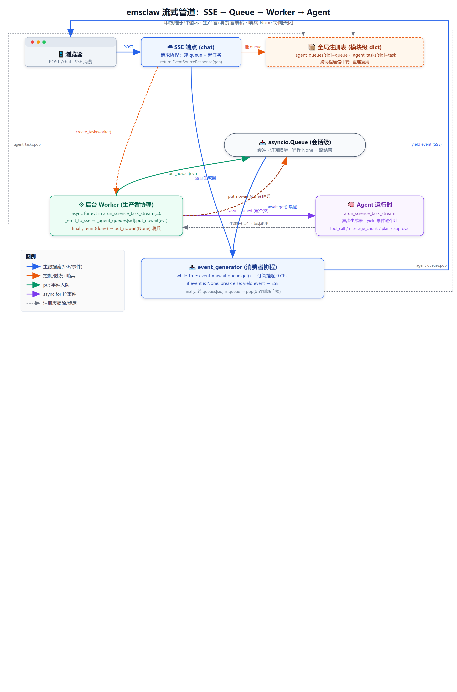
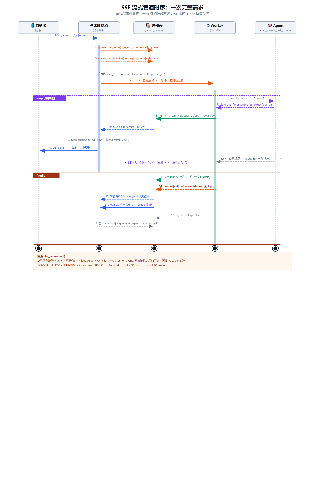
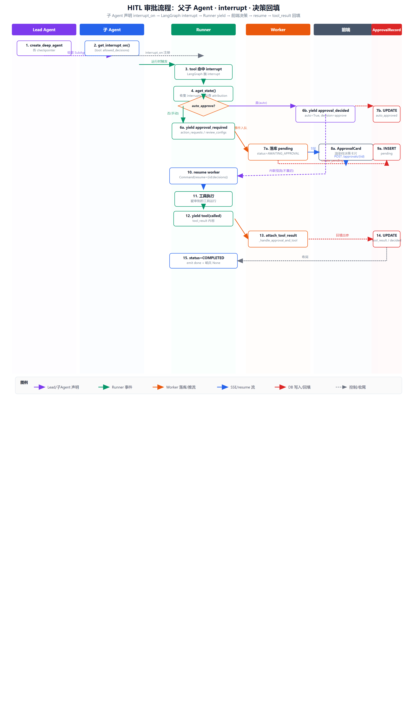
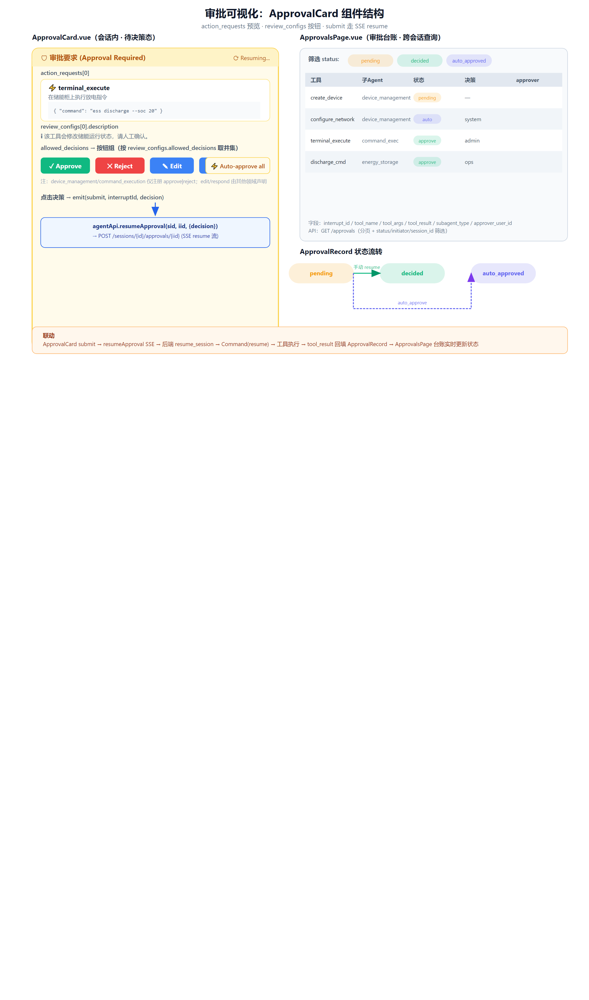

# 架构

> [← 返回总览](../README.md) · [业务介绍](./business.md) · [演示](./demo.md)

本文讲清系统怎么搭起来的：**服务拓扑 → 后端分层 → Agent 运行时 → 一次请求的数据流 → HITL 审批 → 提示词边界 → 部署**。

---

## 目录

- [一、架构总览](#一架构总览)
- [二、服务与端口](#二服务与端口)
- [三、后端分层](#三后端分层)
- [四、Agent 运行时（核心）](#四agent-运行时emsclawbackenddeepagent--核心)
- [五、核心流程：一次请求的数据流](#五核心流程一次请求的数据流)
- [六、审批流程（Human-in-the-Loop）](#六审批流程human-in-the-loop)
- [七、Skills](#七skills)
- [八、其余服务](#八其余服务任务服务--sandbox--前端)
- [九、Agent 提示词与边界](#九agent-提示词与边界)
- [十、技术栈与部署](#十技术栈与部署)

---

## 一、架构总览

<div align="center">

</div>

### 仓库结构

仓库根目录是 `uv` workspace（本身不含代码），成员包都在 `emsclaw/` 下。

```
emsclaw/
├─ emsclaw/
│  ├─ backend/        # FastAPI + DeepAgent 运行时（import 根 emsclaw_backend.*）
│  ├─ builtin-skills/ # 内置 skills（docx/pdf/pptx/xlsx 等，烘焙进后端镜像）
│  ├─ frontend/      # Vue 3 + Vite + TS（import 根 @/）
│  ├─ task-service/  # FastAPI + Celery + croniter 调度（import 根 app.*）
│  ├─ sandbox/       # 远程代码执行 + 文件系统沙箱（DeepAgents backend）
│  └─ tests/         # pytest（asyncio_mode=auto，rootdir = 仓库根）
├─ Skills/           # 用户自行安装的外置 skills（挂载到 /skills/）
├─ scripts/          # 运维与评测脚本
├─ docs/             # 文档与架构图
├─ .env.example      # 环境变量样例
└─ docker-compose.yml
```

## 二、服务与端口

| 服务 | 端口 | 角色 |
|---|---|---|
| `frontend` | 5173 | Vue 3 SPA（Vite dev） |
| `backend` | 12001 (→8000) | FastAPI：auth、sessions、Agent SSE、devices、forecasts |
| `sandbox` | 18080 (→8080) | 远程代码执行 + 文件系统沙箱（DeepAgents backend） |
| `scheduler_api` | 12002 (→8001) | FastAPI 任务调度 API |
| `postgres` | 5433 (→5432) | 共享 DB `ai_agent`（backend + task-service） |
| `redis` | — | task-service 的 Celery broker |

## 三、后端分层

源码位于 `emsclaw/backend/`，容器内运行于 `/app/emsclaw_backend`，import 根 `emsclaw_backend.*`。device/forecast 按 controller → service → mapper 分层：

- **`route/`** —— FastAPI 路由。`sessions.py` 最大：Agent 聊天端点 `POST /sessions/{id}/chat` 返回 SSE 流；还有 skills/tools 增删改查、审批（`POST /sessions/{id}/approvals/{interrupt_id}` → SSE）、文件 I/O、通知。`chat.py` 是被任务服务调用的入口（`POST /api/v1/chat`、`/task/parse-schedule`）。
- **`controller/`** —— 薄 HTTP 层（DTO ↔ API 响应）。
- **`service/`** —— 业务逻辑。
- **`db/`** —— SQLAlchemy 异步 ORM（`User`、`UserSession`、`Session`、`Model`、`Device`、`Forecast`）。`session.py` 暴露 `AsyncSessionLocal`/`get_session`。
- **`mapper/`** —— 同步 mapper 助手（读**同步** `SyncSessionLocal`；测试里 monkeypatch 它换成 sqlite-in-memory）。
- **`entity/`** —— 跨层 DTO/枚举（`device.py` 的 `DeviceDTO`、`forecast.py`、`enums.py` 的事件/审批枚举）。这里的枚举是权威来源，前端 TS 类型与之共用。
- **`user/`** —— 鉴权：`bootstrap.py`（启动时创建默认 admin）、`dependencies.py`（`require_user`）。
- **`im/`** —— IM 集成；`adapters/lark.py` 是飞书长连接适配器。
- **`config.py`** —— `Settings`（pydantic-settings），全靠环境变量驱动。
- **`main.py`** —— app 工厂 + lifespan。

## 四、Agent 运行时（`emsclaw/backend/deepagent/`）—— 核心

基于 **`deepagents` 0.6.x**（LangGraph 内核）。一个 `ScienceSession`（`sessions.py`，thread_id → Postgres checkpointer，支持后端重启后恢复）由 `runner.py` 驱动，以 SSE 事件流推给前端。

- **`engine.py`** —— LLM 工厂（`get_llm_model`）。**重要：** 它 monkey-patch 了 `langchain_openai`，用于 `reasoning_content` 的往返透传（MiniMax/Kimi 等带思考的模型多轮 tool-calling 必需）。
- **`agent.py`** —— 组装 DeepAgent：系统提示词 + 模型 + 工具 + skills + 监控中间件。用 `CompositeBackend` 路由：`FilesystemBackend`（内置 skills，只读）、`FilteredFilesystemBackend`（用户 skills，可屏蔽/删除）、`FullSandboxBackend`（所有文件/命令操作）。
- **`full_sandbox_backend.py`** —— 所有文件/命令/grep 操作都通过 REST 代理到远程 `sandbox` 容器（`SANDBOX_REST_URL`）；按会话隔离执行目录 + shell 状态；共享 `httpx` 连接池；带熔断器。
- **`runner.py`** —— SSE 执行器。合并两类事件源到一个流：(1) `SSEMonitoringMiddleware` 拦截工具调用（精准计时、参数、结果、plan 变化）；(2) LangGraph stream chunk 携带 AI 文本/最终消息。`arun_science_task_stream` 按 profile 分发。
- **`agents/`**（原 `profiles/`）—— 可插拔的 Agent profile。`base.py` 是共享装配件（模型、沙箱、SSE 中间件、offload 中间件、两层记忆：全局 `AGENTS.md` + 会话级 `CONTEXT.md`）。单一 profile：`business`。
  - **`agents/business/`** —— Lead Agent + 一个领域子 agent 注册表。`factory.py` 组装 lead；`registry.py`（`AgentRegistry`）收集 `DomainAgent` 配置 → `deepagents.SubAgent` 列表。各领域在 import 时自注册。
- **`offload_middleware.py`** —— 工具结果过大时自动落盘到工作区，把历史中的 `ToolMessage` 替换为摘要 + 文件路径（防止多轮对话中工具结果被截断丢信息）。
- **`sse_protocol.py` / `entity/enums.py`** —— 事件类型（`EventType`）、审批分支（`ApprovalEventKind`）、工具状态（`ToolEventStatus`）、工具元数据/图标/分类，供前端展示。
- **`diagnostic.py`** —— `DIAGNOSTIC_MODE=1` 时，通过 LangChain callback 把每步 LLM 的完整上下文记录到 `{workspace}/_diagnostic/`，用于框架执行 vs 直接 LLM 调用的报告质量对比。

## 五、核心流程：一次请求的数据流

下面这张时序图展示了一次用户消息从 `POST /chat` 到最终回复流式回到浏览器的完整时间线。**关键设计：单线程事件循环、生产者/消费者解耦、`await` 订阅挂起（等待时不烧 CPU）、哨兵 `None` 协同关闭、重连游标回放。**

<div align="center">

</div>

### 数据流的八步

1. **浏览器** `POST /sessions/{id}/chat` → SSE 端点（请求协程）。
2. 端点建一个会话级 `asyncio.Queue`，按 `session_id` 挂到全局注册表 `_agent_queues`（让 worker 能凭 sid 找到）。
3. 端点 `asyncio.create_task(worker)` 起后台生产者协程，**不等待**立即返回 `EventSourceResponse(event_generator())`。`event_generator` 是消费者生成器。
4. **Worker（生产者）**：标 RUNNING → `async for evt in arun_science_task_stream(...)` 从 Agent 运行时**逐个拉事件** → 每个事件 `_emit_to_sse` 即 `_agent_queues[sid].put_nowait(evt)` 塞进队列。
5. **消费者（event_generator）**：`while True: event = await queue.get()` —— 这是**订阅挂起**，不是轮询。队列空时协程挂起睡眠（0 CPU），worker `put` 时由 asyncio 主动唤醒。拿到非 `None` 事件就 `yield` 给 SSE → 浏览器。
6. **Agent 生成完毕**：`arun_science_task_stream` 不再 yield（异步生成器耗尽）→ worker 的 `async for` **自然退出** → 进 `finally`。
7. Worker `finally`：先 `emit(done 事件)`（本轮统计 / 文件清单），再 `put_nowait(None)` **哨兵**，最后 `_agent_tasks.pop(sid)`。
8. 消费者拿到 `None` → `break` 收摊 → `finally` 里用 `is` 校验后 `_agent_queues.pop(sid)`（防止误删后续新连接换上的新 queue）。

### 几个关键约定

- **两层 DTO**：`entity/*`（Pydantic，跨域契约）vs `controller/*`/`service/*` 的 API 响应模型。`entity` 枚举是前后端共享字段值的唯一真相源。
- **同步与异步 SQLAlchemy 并存**：`db/` 是异步（`AsyncSessionLocal`）；`mapper/` 用**同步** `SyncSessionLocal`，服务于不能异步的工具。
- **Agent 回复必须用中文**（business lead 提示词里强制）—— 专业术语除外。
- **profile 分发**发生在 `runner.arun_science_task_stream`：所有 mode 都走 `_arun_v2_stream`（`astream_events` version=v2）。`business` 有 checkpointer + HITL/审批 + `durability="exit"`、不传 history；其他未知 mode（含历史 team_ops 会话）normalize 后落到 business。
- **HITL 审批**：`DomainAgent` 子类可 override `get_interrupt_on()` 标记需要人工审批的工具（如 `device_management` 对 `create_device`/`configure_network` 触发 interrupt）。Lead 的 `create_deep_agent` 必须传 `checkpointer`，interrupt 状态才能持久化跨重启。
- 会话持久化：`Session.thread_id` → LangGraph Postgres checkpointer，支持后端重启后恢复 Agent。

## 六、审批流程（Human-in-the-Loop）

下面这张泳道图展示了父子 Agent 的 HITL 审批完整生命周期：子 Agent 声明 `interrupt_on` → 工具命中触发 LangGraph interrupt → Runner 检测并 `yield approval_required`（带 `action_requests` / `review_configs` / 父子 attribution）→ Worker 落库 pending + 标 `AWAITING_APPROVAL` → 前端决策。决策有两条路径：**手动** `POST /approvals/{interrupt_id}` 合成 `Command(resume)` 起一次 resume worker；**auto_approve** 在 runner 内 `yield approval_decided(auto=True)` 内联续流。工具执行后，Worker 的 `_handle_approval_and_tool` 把 `tool_result` 回填到 `ApprovalRecord`，状态从 `pending` → `decided`/`auto_approved`。

<div align="center">

</div>

### 审批可视化（前端）

前端有两处审批界面。会话内：`ApprovalCard.vue` 渲染待决策卡片——`action_requests` 按工具名展示（name + description + args JSON 预览），`review_configs.description` 给人读提示，`allowed_decisions` 取并集渲染按钮（`approve`/`reject`/`edit`/`respond` 子集），外加"Auto-approve all"开关。点击决策即 `emit(submit, interruptId, decision)` → `agentApi.resumeApproval(...)` 走 SSE resume 流。跨会话：`ApprovalsPage.vue` 是审批台账，`GET /approvals` 分页 + 按 `status`（pending/decided/auto_approved）/initiator/session_id 筛选，每行展示工具名、子 Agent、状态徽章、决策、审批人。

<div align="center">

</div>

## 七、Skills

- **内置 skills**（`emsclaw/builtin-skills/`）—— COPY 进镜像；`core_kit/skills.py` 的 `RETAINED_SKILLS` 白名单决定加载哪些（docx/pdf/pptx/xlsx、feishu-setup）。只读挂载到 `/builtin-skills/`。
- **外置 skills**（`Skills/`，挂载到 `/skills/`）—— 用户自行放入；可屏蔽/删除。

## 八、其余服务：任务服务 / Sandbox / 前端

### 任务服务（`emsclaw/task-service`，import 根 `app.*`）

FastAPI + Celery + croniter。`app/main.py` 是工厂；路由 `api/tasks.py`（调度任务 CRUD）、`api/webhooks.py`。`app/tasks.py` 是 Celery 任务；`celery_app.py` 定义 worker/beat。`services/schedule_parser.py` 把自然语言调度描述转 crontab。`services/chat_client.py` 调后端 `/api/v1/chat` 执行任务运行。与后端共享同一个 `ai_agent` Postgres DB。

### Sandbox（`emsclaw/sandbox`）

基于预置 sandbox 镜像（base `all-in-one-sandbox`），扩展了 Python 3.12、Node 工具（skills/docx/pptxgenjs）、pandoc/libreoffice/poppler（文档 skills 用）。只读接收 `Skills/`、`builtin-skills/`，读写 `workspace/`。

### 前端（`emsclaw/frontend`）

Vue 3 + Vite + TypeScript + Tailwind + reka-ui。`src/main.ts` 内联定义路由（无单独 router 文件）。`src/api/` 是按领域划分的带类型 axios 客户端；`src/pages/` 是路由组件（ChatPage、DevicesPage、ForecastPage、Skills/Tools 页、Tasks 页）。Vite 代理 `/api`→backend、`/task-service`→scheduler_api。`@` 别名 → `src`。SSE 用 `@microsoft/fetch-event-source` 消费；终端用 xterm，代码用 monaco，markdown 用 marked+katex+mermaid。

## 九、Agent 提示词与边界

一个多 Agent 系统里有 **五个不同层级的东西**，每一层目的不同、写在不同的地方、回答不同的"做什么 / 不做什么"。把它们混在一起写，系统就会失败。

### 五层总览

| 层 | 写在哪 | 给谁看 | 目的 |
|---|---|---|---|
| ① 父 agent 提示词 | Lead 的 `system_prompt`（`factory.py`） | 父 LLM | 意图理解 + 路由 + 收口整合 |
| ② 子 agent 描述 | `DomainAgent.__init__(description=...)`，经 `task` 工具 schema 注入 | 父 LLM | 让父判断"这活交不交给它" |
| ③ 子 agent 提示词 | 各域 `prompts.py`（Langfuse 版本化拉取 + 本地兜底） | 子 LLM | 在自己领域内自主决策、用好工具 |
| ④ Skill 边界 | skill 内说明 / 子 prompt 里的 skill 调度规则 | 看具体层 | 何时启用一整套打包能力 |
| ⑤ 工具边界 | 工具 docstring + 调用时机说明（框架自动注入 schema） | 持有该工具的 agent | 单个原子操作的触发边界 |

**关键区分：② 和 ③ 是两个不同的东西，绝不能混着写。**

- ② 是给父看的"名片"，目的只有**路由判断**——父看了它决定"交不交给你"。它要回答的是"你处理什么、不处理什么、什么情况下把你叫出来"。
- ③ 是给你自己看的"岗位手册"，目的是**执行质量**——一旦被叫出来后你怎么干活。它要回答的是"你怎么分析、用哪个工具、何时停"。

最常见的失败：把 ③ 的内容塞进 ②，父上下文被撑爆、路由判断反而模糊；或把 ② 写成 ③，父根本看不出该不该把任务转交给你。**② 只管路由，③ 只管执行。**

### 每一层的"做什么 / 不做什么 / 交给谁"

**① 父 agent 提示词**
- 做：拆解用户意图 → 判断归哪个子 agent → 转交（`task` 工具）→ 收回结果整合给用户。
- 不做：亲自调用领域工具、替子 agent 回答专业问题、替子 agent 做领域内决策；专家报告做不了时，如实转告用户，**不**用沙箱（`execute`/`read_file`/`write_file`…）绕过。
- 交给谁：领域活交给对应子 agent；自己只做"分发 + 收口"。

**② 子 agent 描述（给父的名片）**
- 做：一句话说清"我处理 X 类问题"+ 触发条件。
- 不做：写完整人设、写工具细节、写执行流程、堆 emoji（这些属于 ③，不该污染父的判断）。
- 目的：父读完这段，能在 1 秒内判断"这个请求交不交给你"。判断不了 = ② 没写清。

**③ 子 agent 提示词（自己的岗位手册）**
- 做：领域内分析、调用自己注册的工具、给领域结论、该人工确认就停下来问。
- 不做：跨领域回答、做父该做的路由、调用没注册给自己的工具、替别的子 agent 拍板。
- 交给谁：遇到不归自己的部分 → 明确说"这超出我的范围，请交回主 agent 分发"，而不是自己硬答。

**④ Skill 边界**
- 做：启用一整套打包能力（如"生成一份 PDF 报告"这种多步骤流程）。
- 不做：用 skill 去做本该单个工具完成的事、用 A skill 干 B skill 的活。
- 交给谁：skill 是"一整类能力"，粒度比工具大；当任务是一整套流程而非单步操作时才启用。

**⑤ 工具边界**
- 做：单个原子操作（查一台设备、算一次优化）。
- 不做：在工具描述里塞跨工具的流程逻辑、把"何时用"写成"智能判断"。
- 交给谁：流程编排属于 ③，不属于 ⑤；工具只管"我接收什么参数、返回什么、失败怎么办"。

### 验证标准：每一层都能独立通过"三问"

对每一层，拿一个具体请求问三问，必须能在该层 prompt 里直接找到答案：

| 层 | 三问 |
|---|---|
| ① 父 | 这事归我分发吗？该交给哪个子 agent？收回结果后我怎么收口？ |
| ② 子描述 | 这活交不交给它？什么情况下交？什么情况下不交？ |
| ③ 子提示词 | 我该不该接？接了用哪个工具？不归我的交给谁？ |
| ④ skill | 这任务是整套流程还是单步操作？该不该启用 skill？ |
| ⑤ 工具 | 这工具能不能干这事？前置条件满足吗？失败怎么办？ |

任何一层答不出"做什么 / 不做什么 / 交给谁"，那层就是漏的——漏的那层就会成为整个系统失败的地方。

### 父子交接协议

五层各自的边界之外，还要显式定义**交接协议**——父子之间怎么传递任务、怎么回传结果：

- **父 → 子**：`task` 转交时带什么（用户原始意图 + 已知上下文 + 期望输出形态），而不是只丢一句"你处理一下"。
- **子 → 父**：回传什么（结论 + 依据 + 是否需要人工介入 + 是否有遗留问题），让父能直接整合，而不是子 agent 自顾自说一段话就结束。

没有这张交接单，父的"整合"会退化为"拼接"，给到用户就是散的。

### 实操约定（踩坑提炼）

- **不要在 prompt 里枚举工具。** `create_deep_agent(tools=[...])` 已把每个工具的 schema + docstring 自动注入 agent 上下文。子 prompt 再手写一遍"可用工具"清单 = 冗余 + 必然漂移（工具集是代码真相，prompt 那份是人手抄的副本，迟早不一致）。prompt 里只写**调度策略**（调用顺序、前置条件、何时绝不触发、失败兜底），这些是 schema 表达不了的。
- **同理，Lead 不要靠手写的 `{capabilities}` 段做路由。** `create_deep_agent(subagents=[...])` 已把每个子 agent 作为 `task` 工具注入（描述 = ②）。Lead 再 `{capabilities}` 抄一遍职责 + 工具清单，不仅冗余，还会把子 agent 的工具清单暴露给父，诱导父越权直接调子 agent 的工具。
- **职责重叠 = 路由失败。** 若两个子 agent 的 ② description 都声称负责同一类请求（如"场站分析"），父无法判断交给谁。重叠领域必须强制切分，让职责只落在一个 agent。
- **子 agent 不做路由。** ② description 与 ③ prompt 只声明"我处理什么 / 我不处理什么"，**不指名"超出范围交给 X 专家"**。路由判断是主 agent 的职责——子 agent 没有全局视图，指名等于越权替主 agent 做决策，且会把 description 和别的 agent 的名字耦合（改名即坏）。不处理时，子 agent 直接返回"不支持/超出范围"，由主 agent 重新分配。
- **委派必须带返回契约。** 主 agent 委派 `task` 时，要强制要求子 agent：**把专业产出（结论/报告/数据依据/操作结果/提案）作为结果返回给我，不要直接对用户说话**——不问候、不追问用户、不替主 agent 做跨领域整合收口。子 agent 的产出是"返回给主 agent 的交付物"，面向用户的最终呈现与多专家结果整合由主 agent 完成。
  - 这条不同于纯调查型系统（如 deepSearch 的"只传回调查结果"）：emsclaw 的子 agent 是领域专家，产出形态多样（不只有中间发现），所以用"专业产出"而非"调查结果"；但"不直接对用户说话"的契约一致。

## 十、技术栈与部署

### 技术栈

| 层 | 技术 |
|---|---|
| 后端 | Python 3.13 · FastAPI · SQLAlchemy(async) · LangGraph · DeepAgents 0.6.x · langchain-openai |
| 前端 | Vue 3 · Vite · TypeScript · Tailwind · reka-ui · xterm · monaco · marked+katex+mermaid |
| 任务调度 | Python 3.13 · FastAPI · Celery · croniter · Redis |
| 沙箱 | Python 3.12 · 远程代码执行 + 文件系统沙箱 |
| 数据 | PostgreSQL 16 · Redis 7 |
| 工具链 | [`uv`](https://docs.astral.sh/uv/) · Docker Compose · pytest |

### 多架构镜像发布

`./release.sh` 为 `emsclaw/*/Dockerfile` 构建 `linux/amd64,linux/arm64` 镜像，打 `release-vX.Y.Z` 标签，并更新 `docker-compose-release.yml`。可传模块名只构建子集，或设 `REGISTRY` 执行 push。

```bash
./release.sh                    # 构建全部模块
./release.sh backend            # 只构建 backend
REGISTRY=ghcr.io/xxx ./release.sh   # 构建并 push
```

### 环境变量

后端、任务服务、沙箱的全部配置都由环境变量驱动（见各 `config.py` / `Settings`）。`.env` 提供本地默认值，生产部署按需覆盖。

### Docker 运行与热重载注意

`docker-compose.yml` 拉起完整栈。Windows 下有 `.bat` 辅助脚本（`rebuild-all.bat`、`rebuild-backend.bat`、`restart-frontend.bat`）。

```bash
cp .env.example .env    # 首次运行，按需填写
docker compose up -d
```

> **⚠️ 没有热重载：** backend 与 frontend 源码都**没有** bind-mount（`Dockerfile.dev` 把源码 COPY 进镜像跑，无 HMR），容器内跑的就是镜像里的代码。修改 backend Python 或 frontend 源码后**都需重建镜像**：
> ```bash
> docker compose build backend && docker compose up -d backend
> docker compose build frontend && docker compose up -d frontend
> ```
> `restart-frontend.bat` / `restart backend` 只重启不重建，**不会**加载新代码。

---

> [← 返回总览](../README.md) · 相关文档：[SSE 队列/Worker/Agent 流程图](./sse-queue-worker-agent-flow.svg) · [SSE 全链路分解图](./sse-pipeline/) · [需求响应设计](./design-demand-response-workflow.md)
