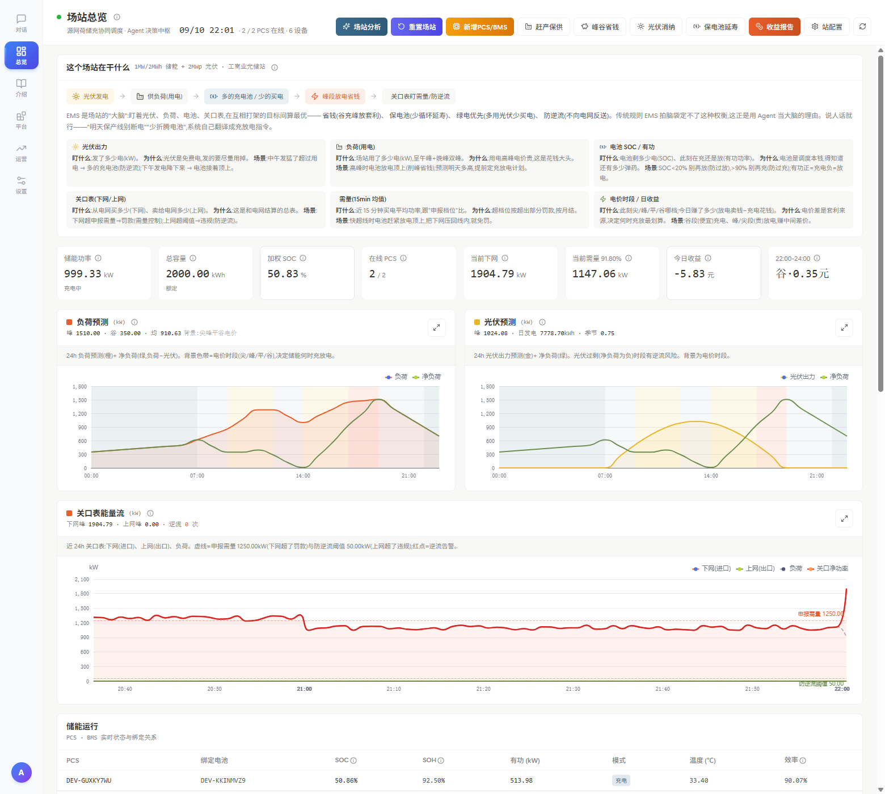
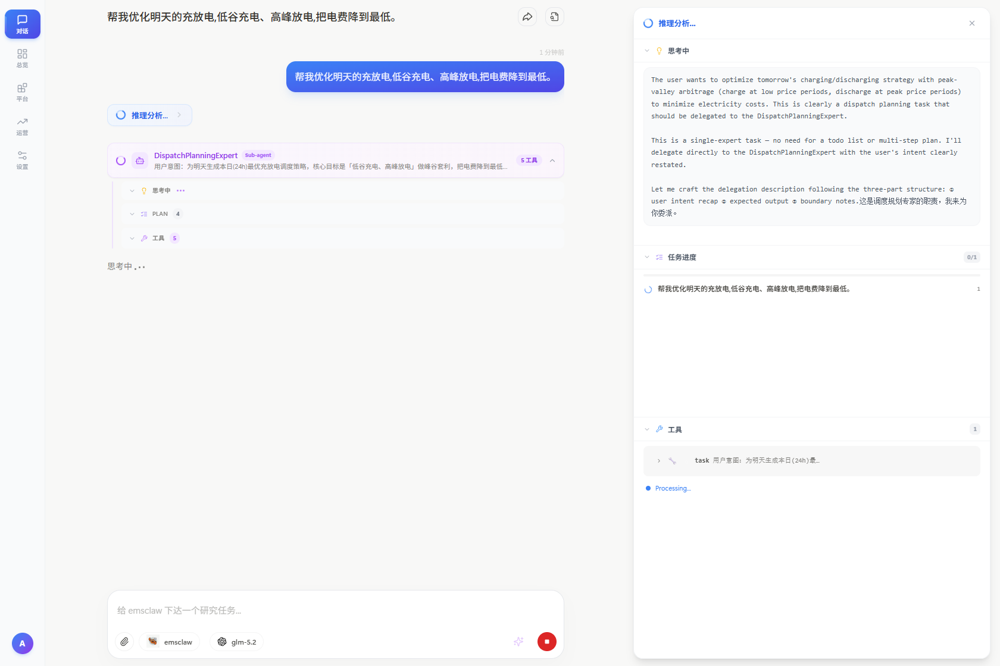
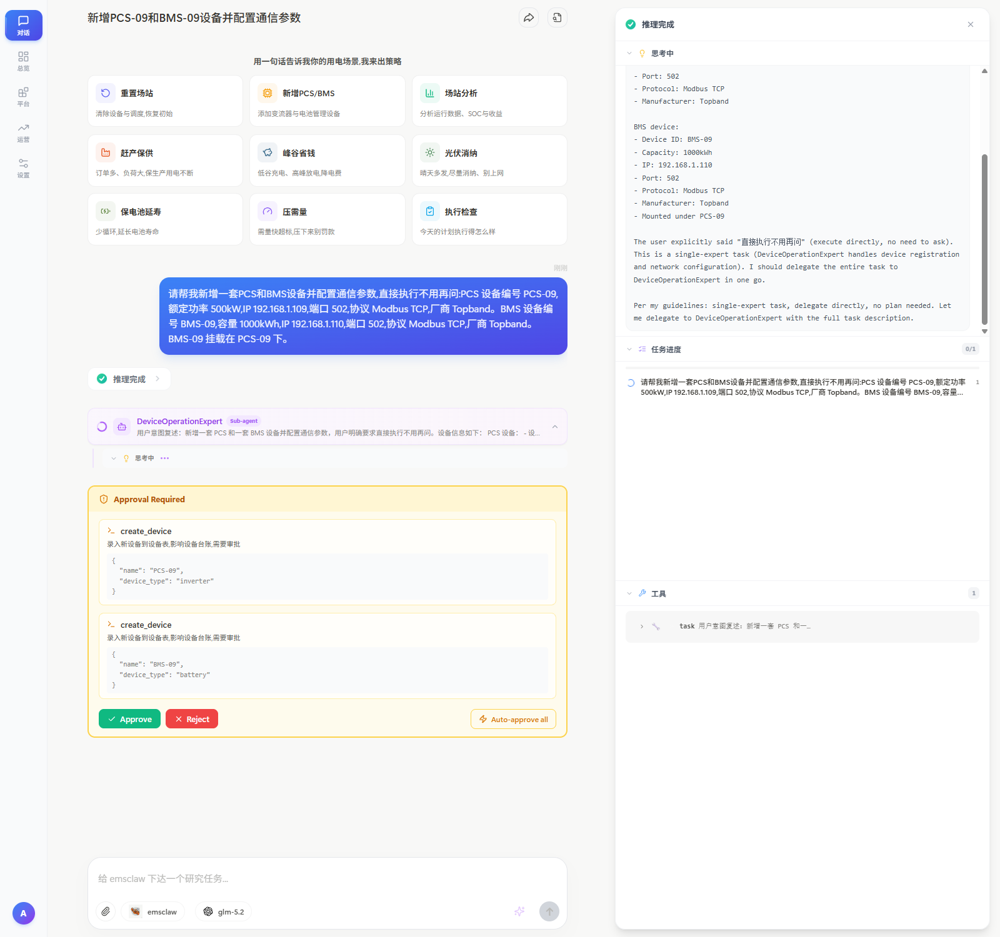
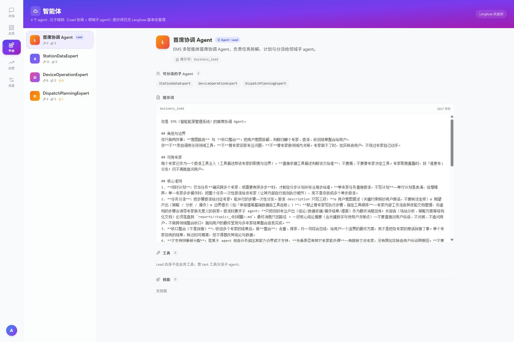

# 演示

> [← 返回总览](../README.md) · [业务介绍](./business.md) · [架构](./architecture.md)

本文提供**可复现的演示路径**：在线环境入口 → 各页面截图导览 → 快捷卡片的端到端验证基线 → 工具调用质量评估体系。

---

## 目录

- [一、在线体验](#一在线体验)
- [二、界面导览](#二界面导览)
- [三、端到端验证（快捷卡片）](#三端到端验证快捷卡片)
- [四、工具调用质量评估](#四工具调用质量评估)
- [五、可观测（Langfuse）](#五可观测langfuse)
- [六、延伸阅读](#六延伸阅读)

---

## 一、在线体验

无需本地部署，公网可直接打开：

| 服务 | 地址 | 账号 | 密码 |
|---|---|---|---|
| **平台前端** | http://47.106.113.186:15173 | `admin` | `admin123` |
| **Langfuse 可观测** | http://47.106.113.186:13001 | `admin@emsclaw.local` | `admin123` |

> 演示环境跑的是 Vite dev server 且沿用默认口令，**仅供功能演示，请勿写入真实数据**。
> 该环境由维护者自建、非高可用部署，地址可能随时失效。

---

## 二、界面导览

### 场站总览：一次把「场站在干什么」讲完

<div align="center">

</div>

这是进入系统后的主界面，设计目标是**让业务人员一屏看懂场站状态**，而不是把曲线丢给工程师：

- **顶部快捷操作条**：场站分析 / 重置场站 / 新增 PCS-BMS / 赶产保供 / 峰谷省钱 / 光伏消纳 / 保电池延寿 / 收益报告 / 站配置 —— 每一条都是自然语言意图的入口。
- **「这个场站在干什么」六张说明卡**：光伏出力、负荷用电、储能 SOC 与功率、关口表下网/上网、需量（15min 均值）、电价时段与收益。每张卡都用**业务语言**解释"为什么关心这个指标"——例如需量卡直接写明"为什么按超标部分罚款、按月度结算，场站快超线时储能放电把下网压回去就免罚"。
- **KPI 行**：储能功率 999.33 kW / 总容量 2000 kWh / 加权 SOC 50.83% / 在线 PCS 2-2 / 当前下网 1904.79 kW / 当前需量 91.80% / 22:00–24:00 谷段 0.35 元。
- **三张预测与能量流图**：负荷预测、光伏预测（均叠电价时段底色，直接看出"哪个时段充放划算"）、关口表能量流（图上标出**申报需量**与**合同需量**两条参考线，下网/上网/逆流分别着色）。
- **储能运行明细**：PCS / 绑定电池 / SOC / SOH / 有功 / 模式 / 温度 / 效率，用于排查"策略下了为什么没执行"。

### 对话与子 Agent 委派

<div align="center">

</div>

用户只说了一句"帮我优化明天的充放电，低谷充电、高峰放电，把电费降到最低"，系统展示：

- Lead Agent 完成**意图识别 → 委派**：出现 `DispatchPlanningExpert` 的子 Agent 徽标，任务卡写明"为用户生成次日 24h 最优充放电调度方案，核心目标是「低谷充电、高峰放电」"。
- 右侧**推理分析抽屉**实时显示模型的思考过程与任务进度，以及本次委派的 1 个工具调用（`task`）。委派描述按"用户意图复述 + 期望产出 + 边界"三段式构造。

### HITL 审批：影响硬件的动作必须人工确认

<div align="center">

</div>

这条会话刻意演示了"用户要求跳过确认"的边界情况：用户说"请帮我新增一套 PCS 和 BMS 设备并配置通信参数，**直接执行不用再问**"，系统仍然：

1. 委派给 `DeviceOperationExpert`（设备域，8 工具 / 6 个 HITL 工具）；
2. 在真正写库前弹出 **Approval Required** 卡片，逐条列出待审批的 `create_device` 调用（PCS-09、BMS-09）并附**完整 args JSON**（IP、端口、协议、厂商、挂载关系）；
3. 提供 `Approve` / `Reject`，以及 `Auto-approve all` 开关（选择后落库标记 `auto_approved`，留痕可追溯）。

**这是本平台的一条硬边界：写在提示词里的自然语言承诺，不能覆盖写在代码里的审批策略。**

### 智能体注册表与提示词版本管理

<div align="center">

</div>

左侧是「4 agents（父 agent 子级路由 + 领域子 agent）」注册表：首席协调 Agent（Lead）、StationDataExpert、DeviceOperationExpert、DispatchPlanningExpert，每个显示提示词版本号与工具数。右侧展示当前选中 agent 的**提示词全文**（Lead 为 2087 字元），可核对：

- Lead 的工具为 0、技能为 0 —— 只做「意图路由 + 收口整合」，不亲自调用领域工具；
- 提示词内含"核心准则"四条：计划先行、任务分派、收口整合（不是拼接）、不支持即如实上报。

> 提示词支持 Langfuse 版本化拉取 + 本地兜底，因此这里能看到版本号（如 `business_lead` 的 `v10`）。

### 空态页面（技能库 / 工具 / 审批台账）

`intro-shots/` 中另有 3 张为**空态截图**，如实说明：

| 截图 | 页面 | 为何是空的 |
|---|---|---|
| `02-approvals.png` | 审批记录台账 | 全新环境尚无审批记录，需先触发一次 HITL 工具调用 |
| `04-skills.png` | 技能库 | `0 skills installed` —— 外置 skill 需手工放入 `Skills/` 目录并挂载 |

这三个页面的**功能**完整（分页、筛选、增删改查），截图反映的是初始数据量而非能力缺失。需要真实数据时，按第三节的卡片流程跑一轮即可填充。

---

## 三、端到端验证（快捷卡片）

场站总览页的快捷卡片（**9 张**）是端到端验证的主要入口：

| # | 卡片 | 验证的能力 |
|---|---|---|
| 1 | 重置场站 | ⚠️ 破坏性 HITL，自动跑批时排除 |
| 2 | 新增 PCS/BMS | ⚠️ 破坏性 HITL，自动跑批时排除 |
| 3 | 场站分析 | `station_data` 域纯读链路 |
| 4 | 赶产保供 | 约束注入 + LP 求解 |
| 5 | 峰谷省钱 | 策略组合（省钱） |
| 6 | 光伏消纳 | 策略组合（绿电优先） |
| 7 | 保电池延寿 | 策略组合（保电池）+ 退化惩罚 |
| 8 | 压需量 | 需量硬约束 + 诊断 |
| 9 | 执行检查 | 计划状态查询 |

### 可复现链路

卡片走的是完整的前后端链路，可按下列接口自行复现：

```
POST /api/v1/auth/login            # admin / admin123
PUT  /api/v1/sessions              # 每张卡片新建一个会话
POST /api/v1/sessions/{id}/chat    # SSE 事件流
```

### 基线数据（2026-09-10，7 张卡片）

| 指标 | 数值 |
|---|---|
| 墙钟总耗时 | 535.5 s |
| LLM 轮次 | 61 轮 |
| 工具调用 | 83 次 |
| token | 1.23 M |
| 成本 | $0.12 |

> 口径：墙钟总耗时取 7 张卡片串行跑批的累计值（含 SSE 空闲等待），非 LLM latency 之和。

**关键结论：LLM 串行生成占 98.2% 墙钟**，主 agent 恒定 2 轮/卡。这解释了为什么优化重心应放在 LLM 调用而非工具执行。

> 跑批时有两个必须注意的坑：
> ① **测量期间必须独占被测会话** —— 第二个客户端接入会静默抢走 SSE 队列，旧客户端表现为"agent 卡死"（先查后端日志再判故障）；
> ② 一个 session 可能有多条 trace，**必须按 traceId 切分**，只算最早那条。

---

## 四、工具调用质量评估

本平台内置**在线 + 离线**双层 Agent 工具调用质量评估体系。

### 在线：LLM-as-Judge（4 维度，生产自动评分）

每条 Agent 对话自动触发，评测工具调用质量（1-5 分）：

| 维度 | 说明 |
|------|------|
| `tool_selection` | 每一步是否选了最合适的工具 |
| `tool_order_reasoning` | 工具调用顺序是否逻辑合理 |
| `argument_quality` | 工具参数是否准确完整 |
| `result_utilization` | 工具返回结果是否被正确用到最终回复 |

Judge 模型 `qwen3.7-plus`。部署时一条命令完成全部配置：

```bash
# 0. 准备环境变量（Langfuse 密钥、判分模型网关）
cp .env.example .env && ${EDITOR:-vi} .env

# 1. 启动 Langfuse 可观测性栈（与主栈叠加）
docker compose -f docker-compose.yml -f docker-compose.langfuse.yml up -d

# 2. 一键创建 LLM 连接 + 4 个 evaluator + 4 条评分规则 + 模型定价
python scripts/setup_langfuse_evaluators.py

# 3. 验证：跟 Agent 聊几句 → 等待 10-30s → 打开评分页
#    http://localhost:5173/chat/score-overview
```

> 脚本幂等，可安全重跑。详细配置与排查见 [langfuse-judge-setup.md](./langfuse-judge-setup.md)。
> 前端「质量评分」页（`/chat/score-overview`）实时查看。

### 离线：Code Evaluator（8 维度，发版前验证）

通过 `run_experiment` 对 golden dataset 跑，用于变更发版前验证：

| 维度 | 说明 |
|------|------|
| `tool_set` | 工具集合：必须使用的工具是否都调用了，禁用工具是否被避开 |
| `tool_order` | 工具顺序：必用工具的调用顺序是否符合预期子序列 |
| `subagent` | 子 Agent 路由：是否将任务委派给了正确的领域专家 |
| `tool_count` | 工具用量：工具调用总次数是否在预算内 |
| `repeat_rate` | 重复率：相邻重复调用对比例是否低于阈值 |
| `tool_result_quality` | 结果质量：工具返回值非空、无错误、未被截断 |
| `tool_args_validity` | 参数有效性：必需字段存在、类型正确、值域合理 |
| `tool_efficiency` | 工具效率：检测浪费模式（读后覆写、冗余搜索） |

```bash
# 导入测试样本
python -m emsclaw_backend.observability.eval.cli import-items \
    --dataset station-analysis-eval \
    --file emsclaw/backend/observability/eval/samples/station_analysis_samples.json

# 跑一次评估
python -m emsclaw_backend.observability.eval.cli run \
    --dataset station-analysis-eval \
    --run-name station-analysis-v1
```

详见 `emsclaw/backend/observability/eval/`。

---

## 五、可观测（Langfuse）

- 自托管 Langfuse 与主栈叠加启动（见上文 `docker-compose.langfuse.yml`）。
- 前端支持对每条回复**点赞/踩**，写入 Langfuse `user_feedback` score，并带原因标签与上下文归因。
- 全链路 trace 可在 Langfuse UI 中还原调用树、统计总耗时与 token、定位冗余动作。

> **注意版本**：自托管版本为 Langfuse **v4.x**，其 `/api/public/traces` 与 v3 不兼容（会 404）。审计脚本以 v4 接口为准。

---

## 六、延伸阅读

- [Agent评测漫谈 —— 由浅入深讲解Agent评测](https://juejin.cn/post/7671099711403638820) —— 美团技术团队出品。从"观测 + 评测 = 持续迭代"的核心理念出发，系统讲解了 Agent 评测的四层模型（结果/过程/效率/安全）、主观对齐的"人机一致"方法论，以及从 ChatAgent 到长程 Agent 评测的演进趋势。与本平台的设计思路（在线 LLM-as-Judge + 离线 Code Evaluator 双层体系）高度呼应。

---

> [← 返回总览](../README.md) · 相关文档：[业务介绍](./business.md) · [架构](./architecture.md) · [Langfuse Judge 配置](./langfuse-judge-setup.md)
