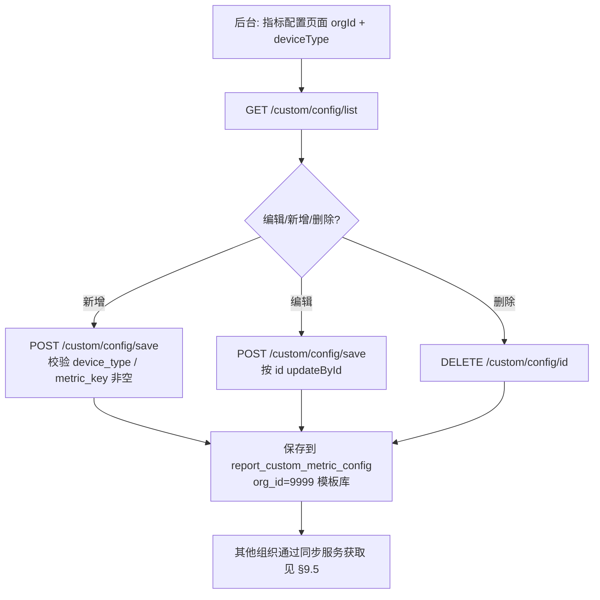
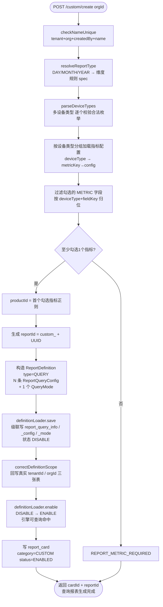

#######################################################################################################################

```
# 自定义报表 / 指标 设计文档

> 版本：V2.2（对应 2026-08-24 最近提交，commit `745d84bde` / `cbfeff48b`）
> 范围：指标配置 → 指标目录 → 创建/编辑自定义报表 → **生成查询报表**（含核心流程）
> 模块：`ibms-manager/ibms-report-biz`（`com.topband.ibms.report.biz`）、平台组件 `platform.component.query`（查询引擎，外部 jar）
> 关联文档：
> - 需求与页面交互：`report_center_requirements.md`
> - 模板库存储流目录（storage_id / identifier / expression）：`template_storage_catalog.md`
> - 46 个默认指标配置清单与存储可用性核对：`default_metric_config.md`

---

## 1. 背景与范围

### 1.1 功能定位

IBMS 报表中心提供「自定义报表」能力：用户按**设备类型**（光伏逆变器 PV / 储能变流器 PCS / 电池管理系统 BMS / 电表 EM）+ **指标**（46 个固定指标）勾选，创建日/月/年维度的自定义报表。保存时后端把勾选的指标**翻译成平台查询引擎可执行的查询报表定义**（`type=QUERY`），启用后即可被引擎查询命中，供详情页取数、渲染与导出。

### 1.2 最近提交的增量（本文档重点）

`745d84bde` / `cbfeff48b`（2026-08-24）在既有 v1 之上补齐了 4 块：

1. **多设备类型支持**：一个报表可多选设备类型（PV/PCS/BMS/EM），`getMetrics` 按设备类型批量返回目录，勾选字段按 `(deviceType, fieldKey)` 归位，列序号跨设备类型全局递增。
2. **取数方式 `agg_type`**：指标配置新增 `agg_type` 列（`SUM`=聚合值/累计量、`TOP`=最新值/瞬时量），创建报表时据此派生引擎 `rangeAggregation`（`SUM→sum`、`TOP→top`）。
3. **存储可用性标记 `storageStatus`**：指标**固定返回、不隐藏**，每个指标按模板库 `report_storage_info` 实时判定 `AVAILABLE` / `INDEX_MISSING` / `NO_STORAGE`；待补配指标**允许勾选创建**（报表正常建出，补配存储后自动出数）。
4. **表达式转换**：配置表 `expression` 用 `#{metricKey}` 引用本表其它指标，创建时转换为引擎 `#storageId` 引用；并修复引擎 save 强制 tenantId=ROOT 导致的**租户/组织归属错乱**（`correctDefinitionScope` 回写三张引擎表）。

### 1.3 范围边界

本文档覆盖到「**生成查询报表**」为止：即创建/编辑后，引擎侧 `report_query_info`（主表）+ `report_query_config`（查询配置）+ `report_query_mode`（查询模式）三张表落库并置为 ENABLE。生成之后的详情查询 / 导出走平台引擎查询链路（`POST /report/query/chart`），见 `report_center_requirements.md` §4.2，不在本文档展开。

---

## 2. 总体架构

```

┌───────────────────────── 前端 (报表中心) ─────────────────────────┐
│  列表页 /custom/cards        创建报表页 /custom/metrics → /custom/create │
└───────────────┬──────────────────────────────────┬───────────────┘
│ REST (orgId 选中组织)              │ REST
┌───────────────▼──────────────┐   ┌──────────────▼──────────────────────┐
│ ibms-report-biz (本模块)      │   │ 指标配置后台维护                      │
│  CustomReportController      │   │  CustomMetricConfigController       │
│   └ CustomReportServiceImpl  │   │   └ CustomMetricConfigServiceImpl   │
│   └ CustomReportSyncService  │   │                                      │
└───────────────┬──────────────┘   └─────────────────────────────────────┘
│ 生成查询报表定义
┌───────────────▼────────────────────────────────────────────────────┐
│ 平台组件 platform.component.query (外部 jar，源码 D:\platformcommon) │
│  ReportDefinitionLoader.save/enable/disable/remove                  │
│   → 落库 iot_platform_db:                                          │
│      report_query_info(主表) / report_query_config / report_query_mode │
│      report_storage_info(存储配置, 只读)                             │
└───────────────┬────────────────────────────────────────────────────┘
│ 查询 (启用后引擎可命中)
┌───────────────▼────────────────────────────────────────────────────┐
│ TDengine 降采样链 thing_property_record_{min|hour|day|month|year}   │
└────────────────────────────────────────────────────────────────────┘

```

- 指标配置 / 自定义报表均按**选中组织 `orgId`** 过滤，仅**模板库 org=9999** 维护指标配置。
- 本模块只负责「生成查询报表定义」；真正取数由平台引擎执行（`WHERE storage_id + product_id` 命中 TDengine 数据流）。

---

## 3. 数据模型设计

### 3.1 `report_custom_metric_config` — 指标配置模板（本模块新建，org=9999 模板库）

一行 = 一个设备类型 × 一个指标。**维度 / 聚合 / 索引类型不在此固化**，创建报表时按报表类型派生。

| 列 | 类型 | 说明 |
|---|---|---|
| `id` | BIGINT PK | 主键 |
| `tenant_id` | BIGINT | 租户（模板库为 0） |
| `org_id` | BIGINT | 组织；**9999=模板库** |
| `device_type` | VARCHAR(32) | 设备类型：PV_INVERTER / PCS / BMS / EM |
| `product_id` | VARCHAR(128) | **产品ID正则**，与模板库 `report_storage_info` 一致（PV=`[1-9]01.*`、PCS=`[1-9]02.*`、BMS=`[1-9]03.*`、EM=`[3-9]06.*`） |
| `metric_key` | VARCHAR(64) | 指标 Key（如 `dayPower`） |
| `metric_name` | VARCHAR(64) | 指标名称（如 日发电量） |
| `storage_id` | VARCHAR(64) | 模板库存储流ID = 引擎 `query.queryId/storageId` |
| `unit` | VARCHAR(32) | 单位 |
| `agg_type` | VARCHAR(16) | **取数方式**：`SUM`=聚合值(累计量：发电量/电能/充放电量) / `TOP`=最新值(瞬时量：功率/电压/电流/SOC/温度/状态) |
| `expression` | VARCHAR(512) | 表达式；`#{metricKey}` 引用本表指标，`#FACTOR_XXX` 引用全局因子 |
| `scale` | INT | 小数位（默认 2） |
| `query_offset` | INT | 查询偏移量（默认 0） |
| `seq` / `display_seq` | INT | 查询/展示序号（模板内占位，创建时被全局列序号覆盖） |
| `need_export` | TINYINT | 是否导出 0/1（默认 1） |
| `is_default` | TINYINT | 是否默认勾选 0/1 |
| `sort_order` | INT | 排序 |
| `status` | TINYINT | 0-禁用 1-启用 |
| `remark` / 审计列 | — | 备注 / create_by / update_by / create_time / update_time |

唯一键：`uk_org_dev_metric(org_id, device_type, metric_key)`；索引 `idx_query(org_id, device_type, status)`。

建表与种子：`script/business/V2_2_0/dml/14_custom_report_metric_config_seed_v3.sql`（幂等：建表 / 老表补 `agg_type` / 先删 org 9999 旧数据再全量插 46 行）。

### 3.2 `report_card` — 报表卡片（本模块新建）

| 列 | 说明 |
|---|---|
| `id` | 卡片主键 |
| `report_id` | 关联引擎 `report_query_info.report_id`（`custom_` + UUID 去横线） |
| `card_name` / `description` | 卡片名 / 描述 |
| `category` | `SYSTEM`=固定报表(全局可见, 不可编辑/删) / `CUSTOM`=自定义 |
| `device_types` | 设备类型枚举名，逗号分隔（多设备类型） |
| `report_type` | `DAY` / `MONTH` / `YEAR`（创建时派生维度） |
| `product_id` | 产品ID正则，**取首个勾选指标的设备类型正则** |
| `selected_fields_json` | 用户勾选字段 JSON（`FieldSelection[]`，含 deviceType/fieldKey/fieldType），编辑回填用 |
| `icon` / `sort_order` | 图标 / 排序 |
| `created_by` / `created_by_name` / `tenant_id` / `org_id` | 归属 |
| `status` | 0-禁用 1-启用 |

唯一键：`uk_tenant_org_name(tenant_id, org_id, created_by, card_name)`（同用户同名不重复）。

### 3.3 引擎表（platform-query 写库，本模块间接产生）

> 表归属 `iot_platform_db`，由 `ReportDefinitionLoader` 级联写入。列名为引擎实体字段（MyBatis-Plus 下划线映射）。

| 表 | 对应实体 | 说明 | 关键列 |
|---|---|---|---|
| `report_query_info` | `ReportDefinition` | **查询报表主表**（1 条/报表） | `report_id`、`name`、`type(QUERY)`、`product_id`、`tenant_id`、`org_id`、`status`(ENABLE/DISABLE) |
| `report_query_config` | `ReportQueryConfig` | **查询配置**（每个勾选指标 1 条） | `query_id`(=`storage_id`)、`storage_id`、`config_type(override)`、`type(data-stream)`、`index_time_dimension`、`range_time_dimension`、`query_time_dimension`、`terms_name(deviceId)`、`range_aggregation(sum/top)`、`result_aggregation(range)`、`expression`、`scale`、`query_offset`、`seq`、`display_seq`、`need_export`、`hidden`、`report_id`、`product_id`、`tenant_id`、`org_id` |
| `report_query_mode` | `QueryMode` | **查询模式**（1 条/报表，承载整体维度默认值） | `report_id`、`resp_data_type(REPORT)`、`conditions`、`tenant_id`、`org_id` |
| `report_storage_info` | `ReportStorageConfig` | **存储配置**（只读参照，模板库维护） | `org_id`、`storage_id`、`product_id`、`index_time_dimension`(min/hour/day…)、`identifiers_json` |

---

## 4. 指标配置设计

### 4.1 固定 46 指标

创建报表不再自由新增指标，而是**固定返回这 46 个指标**（PV 10 / BMS 9 / PCS 10 / EM 17），每个指标带默认配置。完整清单与存储可用性核对见 `default_metric_config.md` §3。

### 4.2 `agg_type` 取数方式（新增）

| agg_type | 语义 | 适用指标 | 创建时派生 |
|---|---|---|---|
| `SUM` | 聚合值（累计量） | 日发电量 / 正向/反向电能 / 充放电量 | `rangeAggregation=sum`、`resultAggregation=range` |
| `TOP` | 最新值（瞬时量） | 功率 / 电压 / 电流 / SOC / 温度 / 状态 | `rangeAggregation=top`、`resultAggregation=range` |

### 4.3 `product_id` 正则与 `storage_id`

- `product_id` 为**正则**（如 PV=`[1-9]01.*`），与模板库 `report_storage_info.product_id` 口径一致，供查询引擎按 `product_id` 正则命中设备。
- `storage_id` = 模板库真实存储流 ID = 引擎 `query.queryId`；查不到流的指标也给出默认 storage_id（占位），后台在存储配置中补配后即出数据。

### 4.4 指标配置管理（后台维护）

接口见 `CustomMetricConfigController`（`/custom/config/*`），供后台增删改查：

- `GET /custom/config/list?orgId=&deviceType=`：返回**全部配置（含禁用）**，便于启用/禁用切换；
- `POST /custom/config/save?orgId=`：新增（插行，status 默认启用）/ 更新（按 id）；
- `DELETE /custom/config/{id}`：删除。

校验：`device_type` 非空、`metric_key` 非空。仅模板库 org 9999 维护，其它组织通过同步服务获取（见 §8）。

---

## 5. 指标目录与字段选择设计（`getMetrics`）

### 5.1 接口协议

```

GET /custom/metrics?deviceTypes=PV_INVERTER,PCS,BMS&reportType=DAY&orgId=9999

```

- `deviceTypes`：逗号分隔，**多设备类型**，去空白/去重，空则报 `REPORT_DEVICE_TYPE_BLANK`；
- `reportType`：`DAY`/`MONTH`/`YEAR`，空默认 `DAY`；决定所需 storage 索引（日报=`hour`、月/年报=`day`）；
- 返回 `List<MetricCatalogVO>`，**每个设备类型一组**；`MetricCatalogVO{deviceType, fields[]}`，`fields` 元素为 `FieldSelectionVO`。

### 5.2 字段 VO 与存储可用性

`FieldSelectionVO{fieldKey, fieldName, fieldType(METRIC), storageId, unit, aggType, storageStatus, isDefault}`。

每个指标**固定返回、不隐藏**，`storageStatus` 按模板库 `report_storage_info` 实时判定：

| storageStatus | 含义 | 判定逻辑 |
|---|---|---|
| `AVAILABLE` | 可用 | `(storageId, productId)` 命中存储流 **且** 索引集合包含所需索引 |
| `INDEX_MISSING` | 索引不足 | 存储流已找到，但缺该报表类型所需索引（如只有 min，日报需 hour） |
| `NO_STORAGE` | 存储待补配 | `(storageId, productId)` 在 `report_storage_info` 查不到 |

### 5.3 判定实现（`loadStorageIndexMap` + `storageStatus`）

```

按 (storageId, productId) 聚合: 查 report_storage_info
WHERE org_id=#{orgId}
AND storage_id IN (本设备类型配置的 storage_id 集合)
AND product_id IN (本设备类型配置的 product_id 集合)
→ Map<(storageId|productId), Set<index_time_dimension>>
每个指标:
indices = map.get(storageId + "|" + productId)
indices 为空          → NO_STORAGE
indices 含所需索引     → AVAILABLE   (日报需 hour, 月/年报需 day)
否则                  → INDEX_MISSING

```

---

## 6. 核心流程：创建自定义报表 → 生成查询报表

入口：`POST /custom/create?orgId=`，body `CreateCustomReportDTO{reportName, description, deviceTypes, reportType, selectedFields[]}`。

`CustomReportServiceImpl.create`（事务）：
`checkNameUnique` → `buildAndSaveDefinition`（核心）→ 写 `report_card`。

### 6.1 校验

1. **名称唯一**：`tenant_id + org_id + created_by + card_name` 存在即报 `REPORT_NAME_ALREADY_EXIST`。
2. **报表类型**：仅 `DAY/MONTH/YEAR`，空默认 `DAY`，非法报 `REPORT_DEVICE_TYPE_BLANK`。
3. **设备类型**：逗号分隔解析，每个必须是合法枚举（`EnergyDeviceTypeEnum`），否则报错。
4. **勾选指标**：仅 `fieldType=METRIC` 参与生成；至少 1 个，否则报 `REPORT_METRIC_REQUIRED`；每个勾选字段必须能在其所属设备类型的配置中归位，否则报 `REPORT_METRIC_NOT_IN_CATALOG`。
   - **存储未配的指标不拦截**（`NO_STORAGE`/`INDEX_MISSING` 均可勾选创建，报表正常建出）。

### 6.2 维度派生规则（`DIMENSION_MAP`）

| 报表类型 | index_time_dimension（索引维度） | range_time_dimension（区间维度） | query_time_dimension（整体维度） | required_index（所需存储索引） |
|---|---|---|---|---|
| `DAY` | hour | hour | day | hour |
| `MONTH` | day | day | month | day |
| `YEAR` | day | month | year | day |

固定项：`type=data-stream`、`termsName=deviceId`、`resultAggregation=range`、`configType=override`、`queryId=storageId`。

### 6.3 勾选指标归位与 `productId`

- 按设备类型分组加载配置，建 `deviceType → (metricKey → config)` 映射；
- 勾选字段按 `deviceType` 归位（**兼容旧数据**：无 `deviceType` 时按 `fieldKey` 在设备类型列表中查找）——因为不同设备类型存在同名指标 key（如 `totalReactiveP`/`totalFactorP`/`runStatus`）；
- `productId`（报表主表）取**首个勾选指标**的 `product_id` 正则。

### 6.4 构造 `ReportDefinition`（内存，未落库）

一份定义 = **1 张查询报表** + **N 条查询配置** + **1 个查询模式**：

```

ReportDefinition
├ report_id = "custom_" + UUID(去横线)      // 全局唯一
├ type = QUERY                              // 识别为查询报表
├ product_id = 首个勾选指标正则
├ tenant_id / org_id / status = ENABLE
├ queries[]:  每个勾选指标 1 条 ReportQueryConfig (列序号全局递增, column*10)
│    query_id        = storage_id
│    storage_id      = cfg.storage_id
│    config_type     = override
│    type            = data-stream
│    index/range/query_time_dimension = spec 派生
│    terms_name      = deviceId
│    range_aggregation = agg_type: SUM→sum / TOP→top
│    result_aggregation = range
│    expression      = #{metricKey} → #storageId 转换
│    scale           = cfg.scale ?: 2
│    seq/display_seq = 全局列序号 (column*10)
│    need_export     = cfg.need_export ?: 1
└ queryMode:
resp_data_type  = REPORT
conditions      = [{ key:"queryTimeDimension", defaultValue: spec.query, required:true }]

```

**表达式转换**：正则 `#\{(\w+)\}` 将 `#{metricKey}` 替换为其所属设备类型配置中对应指标的 `#storageId`；`#FACTOR_XXX` 等非括号引用原样保留。

### 6.5 落库链路（`buildAndSaveDefinition` 第 7~9 步）

```

definitionLoader.save(definition)             // ① 级联写三张引擎表, 状态 DISABLE
├ initType:   由 type=QUERY 识别为查询报表
├ checkParams: 校验每条 query 的 queryId/storageId 非空且不含空格
├ remove:      先按 reportId 清理旧 query_config + query_mode (更新场景兜底)
├ queryInit:   回填 reportId/tenantId/orgId/productId 到每条 query
│                → saveQueryMode 写 report_query_mode
│                → saveQueries(saveBatch) 批量写 report_query_config
└ reportDefinitionDOManager.saveOrUpdate 写 report_query_info 主表 (DISABLE)
correctDefinitionScope(definition.id, reportId, tenantId, orgId)   // ② 纠正归属
└ 引擎 save 内部强制 tenantId=ROOT(1), 这里按真实 tenantId/orgId 回写:
report_query_info / report_query_config / report_query_mode
definitionLoader.enable(definition.id)        // ③ 状态 DISABLE → ENABLE, 引擎方可查询命中

```

> 关键点：save 后**必须** `enable`，否则引擎 `getEnableQueries`（只认 ENABLE）查不到（该处曾因未 enable 而查不到）。

### 6.6 写 `report_card`

```

report_card:
report_id / card_name / description / category=CUSTOM
device_types / report_type / product_id
selected_fields_json = JSON(selectedFields)   // 含 deviceType, 供编辑回填
sort_order=0 / created_by / created_by_name / tenant_id / org_id / status=ENABLED
返回 CreateCustomReportResult{cardId, reportId}

```

### 6.7 生成结果示例（单设备、日报、勾选 2 个 PV 指标）

`report_query_info`：`report_id=custom_xxxx`, `type=QUERY`, `product_id=[1-9]01.*`, `status=ENABLE`

`report_query_config`（2 行）：

| query_id(=storage) | index_td | range_td | query_td | range_agg | result_agg | seq |
|---|---|---|---|---|---|---|
| powerGenerationDay | hour | hour | day | sum | range | 10 |
| pvTotalActiveP | hour | hour | day | top | range | 20 |

`report_query_mode`：`resp_data_type=REPORT`, `conditions=[{"defaultValue":"day","key":"queryTimeDimension","required":true}]`

---

## 7. 编辑与删除

### 7.1 编辑 `PUT /custom/{cardId}?orgId=`

1. `loadOwnedCard(cardId, orgId)`：取不到 → `REPORT_CARD_NOT_EXIST`；`category=SYSTEM` → `REPORT_SYSTEM_NOT_EDITABLE`；
2. `checkNameUnique`（排除自身）；
3. `removeExistingDefinition(reportId)`：查主表 → 若 ENABLE 先 `disable` → `remove`（**全量重建**旧查询定义）；
4. `buildAndSaveDefinition`（同创建）；
5. 回写 `report_card`（含新 reportId、selectedFieldsJson）。

### 7.2 删除 `DELETE /custom/{cardId}?orgId=`

`loadOwnedCard` → 不存在静默返回 → `SYSTEM` 报 `REPORT_SYSTEM_NOT_DELETABLE` → `removeExistingDefinition` → 删 `report_card`。

---

## 8. 模板库同步服务（`CustomReportSyncServiceImpl`）

`syncFromTemplate(tenantId, orgId, targetProductIds)`：模板库（org 9999）→ 目标组织，**全量替换**，按 `productId` 正则过滤（命中目标组织至少一个产品编码，与引擎 `ReportUtils.matchProductId` 一致：精确匹配优先，其次 `String.matches` 正则全匹配）。

同步两类自有数据：

1. **指标配置**：源 = 模板库启用配置 → 过滤 → 删目标组织全部配置 → 插入（id 置空、覆盖 tenant/org、审计标记 `TEMPLATE_SYNC_OPERATOR`）。
2. **自定义卡片**：源 = 模板库 CUSTOM 启用卡 → 过滤 → 删目标组织 CUSTOM 卡 → 插入（id 置空、覆盖 tenant/org、`created_by=0`、`created_by_name=模板库同步`、**reportId 保留**，指向平台组件已同步的查询定义）。

> SYSTEM 固定报表为全局卡，不在此同步。

---

## 9. 流程图

> Mermaid 流程图（GitLab Markdown 原生渲染）。

### 9.1 指标配置管理（后台维护）



### 9.2 指标目录获取（`getMetrics`）

```mermaid
flowchart TD
    A[GET /custom/metrics<br/>deviceTypes / reportType / orgId] --> B[resolveReportType<br/>空默认 DAY 非法报错]
    B --> C[parseDeviceTypes<br/>逗号分隔 去重]
    C --> D{遍历每个 deviceType}
    D --> E[listMetricConfigs<br/>查启用配置 按 sort_order]
    E --> F{配置为空?}
    F -->|是| G[fields 置空]
    F -->|否| H[loadStorageIndexMap<br/>查 report_storage_info 聚合 storageId|productId → 索引集合]
    H --> I[逐指标生成 FieldSelectionVO]
    I --> J[storageStatus 判定<br/>无索引→NO_STORAGE<br/>含所需索引→AVAILABLE<br/>否则→INDEX_MISSING]
    G & J --> K[组装 MetricCatalogVO<br/>固定返回全部启用指标 不隐藏]
    K --> L{还有设备类型?}
    L -->|是| D
    L -->|否| M[返回 List<MetricCatalogVO>]
```

### 9.3 核心流程：创建报表 → 生成查询报表（主链路）



> 「生成查询报表」即 V9→V12：引擎侧查询报表定义落库并启用。生成后可被详情查询链路命中。

### 9.4 单指标查询配置生成（`buildOneQuery`，维度/取数派生）

```mermaid
flowchart TD
    A[单指标 cfg + 所属设备类型 configMap + spec] --> B[query_id = storage_id]
    B --> C[固定项<br/>type=data-stream<br/>terms_name=deviceId<br/>config_type=override<br/>result_aggregation=range]
    C --> D[维度<br/>index_td / range_td / query_td = spec 派生]
    D --> E{agg_type?}
    E -->|SUM 累计量| F[range_aggregation = sum]
    E -->|TOP 瞬时量| G[range_aggregation = top]
    F & G --> H[expression 转换<br/>#{metricKey} → #storageId]
    H --> I[scale = cfg.scale ?: 2<br/>seq/display_seq = 全局列序号 column*10]
    I --> J[need_export = cfg.need_export ?: 1]
```

### 9.5 编辑 / 删除 / 同步

```mermaid
flowchart TD
    subgraph 编辑
    E1[PUT /custom/ 卡片ID loadOwnedCard cardId+orgId] --> E2{取到?}
    E2 -->|否| E3[REPORT_CARD_NOT_EXIST]
    E2 -->|是| E4{SYSTEM?}
    E4 -->|是| E5[REPORT_SYSTEM_NOT_EDITABLE]
    E4 -->|否| E6[checkNameUnique 排除自身]
    E6 --> E7[removeExistingDefinition 先删旧定义]
    E7 --> E8[buildAndSaveDefinition 重建 见 §9.3]
    E8 --> E9[回写 report_card]
    end
    subgraph 删除
    D1[DELETE /custom/ 卡片ID loadOwnedCard] --> D2{取到?}
    D2 -->|否| D3[静默返回]
    D2 -->|是| D4{SYSTEM?}
    D4 -->|是| D5[REPORT_SYSTEM_NOT_DELETABLE]
    D4 -->|否| D6[removeExistingDefinition]
    D6 --> D7[删 report_card]
    end
    subgraph 同步 syncFromTemplate
    S1[模板库 org 9999] --> S2[指标配置: 启用配置 按 productId 正则过滤]
    S2 --> S3[删目标组织全部配置]
    S3 --> S4[插入 覆盖 tenant/org]
    S1 --> S5[自定义卡: CUSTOM 启用卡 按 productId 过滤]
    S5 --> S6[删目标组织 CUSTOM 卡]
    S6 --> S7[插入 保留 reportId]
    end
```



---

## 10. 关键设计决策与权衡


| 决策                                               | 理由                                                                                         | 权衡                                                      |
| -------------------------------------------------- | -------------------------------------------------------------------------------------------- | --------------------------------------------------------- |
| 指标**固定返回、不隐藏**，仅标记 `storageStatus`   | 目录是固定 46 指标清单，隐藏会误导用户以为指标不存在；标记让用户明确「缺什么、补什么后可用」 | 需要前端按状态区分展示（正常勾选 vs 待补配提示）          |
| 待补配指标**允许勾选创建**                         | 报表是配置，补配存储后自动出数，无需重建；避免创建被存储进度阻塞                             | 早期报表可能空数据，靠`storageStatus` 提示兜底            |
| `agg_type` 单独成列（而非在 expression 里）        | 累计量/瞬时量的取数语义差异是报表正确性的核心，显式建模避免误配                              | 需后台在新增指标时选对 agg_type                           |
| 维度/聚合**不固化在配置表**，创建时派生            | 一份指标配置可服务日/月/年三种报表类型；配置表只存指标语义                                   | 维度规则散落在代码（`DIMENSION_MAP`），改规则需发版       |
| 表达式用`#{metricKey}` 引用、创建时转 `#storageId` | 配置表维护的是指标 key，storage_id 随存储补配变化；解耦使表达式不受 storage 调整影响         | 转换依赖「同设备类型」内的 key 解析，跨设备类型引用需注意 |
| save 后`correctDefinitionScope` 回写三表           | 引擎`save` 强制 tenantId=ROOT，导致多租户/组织下查询按真实 tenant+org 取不到                 | 依赖引擎内部实现；若引擎修复需同步移除                    |
| `selectedFieldsJson` 冗余存勾选明细                | 编辑回填无需反查引擎表；卡片详情可直接展示                                                   | 与引擎定义存在双写，需保持一致性（编辑时全量重建）        |
| 编辑采用「先删后建」全量重建                       | 定义结构随勾选指标变化大，增量更新复杂且易残留旧 query 行                                    | 删除重建期间有短暂不可用窗口（事务内）                    |

---

## 11. 发布顺序与注意事项

1. **先执行 SQL 迁移**（`14_custom_report_metric_config_seed_v3.sql`）：为 `report_custom_metric_config` 增加 `agg_type` 列并灌入 46 个默认指标；
2. **再发布新后端代码**：实体已映射 `agg_type` 列，若 SQL 未执行，指标配置列表/指标目录查询会因 `SELECT agg_type` 报「列不存在」；
3. 依赖的存储补配（`NO_STORAGE` 指标）与索引补配（`INDEX_MISSING`）在模板库 `report_storage_info` 侧进行，见 `default_metric_config.md` §4；
4. 新组织开通走「从模板库同步」（§8），无需手工种指标配置。

```

```
